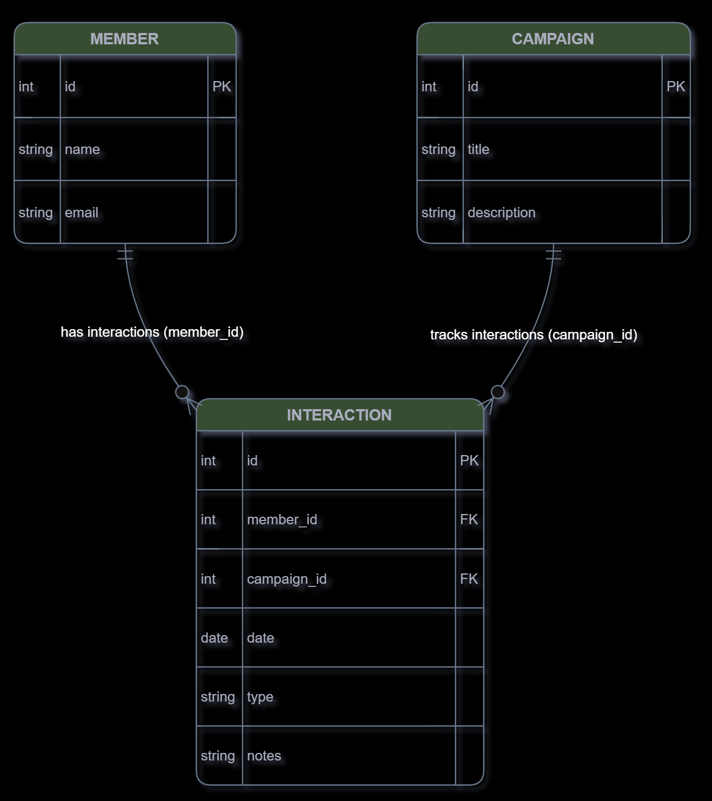

# Healthcare Worker Advocacy CRM

## Overview

This project is a backend system designed to manage and analyze nonprofit advocacy data. It models how organizations track members, campaigns, and interactions using a structured database and API-driven workflow instead of spreadsheets or manual systems.

The system demonstrates a complete data pipeline from data input to storage, querying, reporting, and export.

---

## Current Status

The system is fully functional and supports:

* Full CRUD operations for Members, Campaigns, and Interactions
* Filtering queries by member and campaign
* Aggregated reporting (interaction counts by member and campaign)
* CSV export of interaction data
* End-to-end data pipeline: input → database → API → reporting/export

The project is now in its final refinement and presentation stage.

---

## Data Model (ER Diagram)

Member (1) ----< Interaction >---- (1) Campaign



### Member

* id (PK)
* name
* email

### Campaign

* id (PK)
* title
* description

### Interaction

* id (PK)
* member_id (FK)
* campaign_id (FK)
* date
* type
* notes

---

## Core Features

* Relational database using SQLite
* SQLAlchemy ORM models
* FastAPI REST API
* Full CRUD functionality
* Filtering and query support
* Aggregated reporting endpoints
* CSV export for reporting

---

## API Endpoints (Examples)

### Members

* `GET /members`
* `POST /members`
* `PATCH /members/{id}`
* `DELETE /members/{id}`

### Campaigns

* `GET /campaigns`
* `POST /campaigns`
* `PATCH /campaigns/{id}`
* `DELETE /campaigns/{id}`

### Interactions

* `GET /interactions`
* `POST /interactions`

### Reports

* `/reports/interactions-by-member`
* `/reports/interactions-by-campaign`

### Export

* `/export/interactions.csv`

---

## System Demo

A full walkthrough of the system (including screenshots of API usage and outputs) is available on the project website:

👉 https://timothyfitch.github.io

---

## Technology Stack

* FastAPI
* SQLAlchemy
* SQLite
* Python

---

## How to Run Locally

### 1. Clone the repository

```bash
git clone https://github.com/YOUR_USERNAME/YOUR_REPO.git
cd YOUR_REPO
```

### 2. Install backend dependencies

```bash
pip install fastapi uvicorn sqlalchemy
```

### 3. Run backend API

```bash
uvicorn app.main:app --reload
```

Open:
http://127.0.0.1:8000/docs

---

## Motivation

Many advocacy organizations rely on spreadsheets that are difficult to scale and analyze. This project explores how a simple backend system can structure that data, enable querying, and support meaningful reporting.

---

## Project Website

https://timothyfitch.github.io

---

## About Me

I am an Applied Computer Science student at the University of Colorado Boulder with an interest in backend development, databases, and practical data systems.

This project reflects my focus on building systems that organize real-world data in a structured and usable way.
