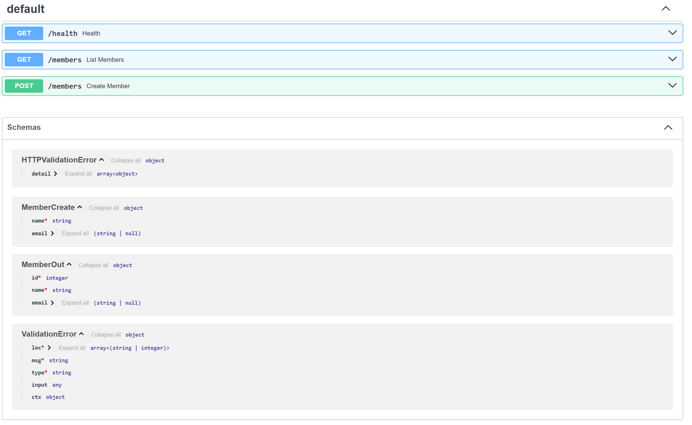

# Home
## Timothy Fitch 
Timothy.Fitch@colorado.edu || timjosfitch@gmail.com

### About Me

I am an Applied Computer Science student at the University of Colorado Boulder with a prior B.A. in Political Science and History from the University of Kansas. My academic focus is on databases, backend development, data analysis, and practical software systems. I am especially interested in building tools that support organizations, advocacy work, and data driven decision making.

Before returning to school, I worked in roles involving data management, outreach coordination, website maintenance, and administrative support. These experiences strengthened my ability to organize complex information, communicate clearly, and deliver reliable results in real-world environments.

### Technical Skills Developed at CU Boulder

- Programming fundamentals and object oriented design  
- Data structures and algorithms  
- Discrete mathematics and problem solving  
- Computer systems fundamentals  
- Data science concepts (probability, statistics, linear algebra)  
- Introductory cybersecurity concepts  
- Technical teamwork and software development practices (Jira, Github)
- Relational database design and SQL

## CSPB 3112

My vision for CSPB 3112: Professional Development in Computer Science is to build a simple backend system that manages and reports on nonprofit advocacy data. The goal is to strengthen my skills in database design, backend programming, and working with structured data in a practical and real world setting.

### Current Status
- Week 1 and 2: Project Idea Exploration and Setup
- Week 3: Beginning Database Design
- Week 4: Backend Setup and Initial Implementation
- Week 5: Website Refinement / Database Preparation
  
### Navigation
- [Weekly Updates](weekly-updates.md)
- [Project Proposal](projectproposal.md)

### Current Progress Screenshots

