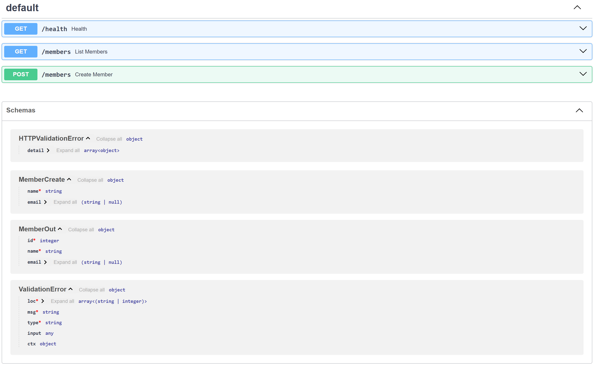
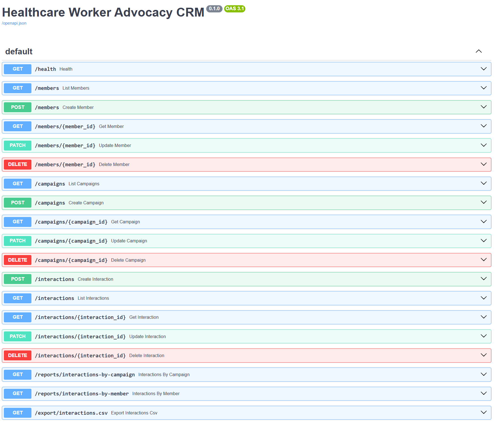

# Weekly Project Updates

### Week 2 – Project Ideas and Setup

### What did I do last week?
- Reviewed course expectations 
- Explored project ideas in the nonprofit space
- Reflected on instructor feedback suggesting backend focused nonprofit tools
- Set up this GitHub Pages site to document weekly progress

### What do I plan to do this week?
- Select one specific nonprofit focused backend project idea
- Define the project scope / core features
- Begin with the formal project proposal
- Sketch an initial data model and API structure

### Are there any impediments?
- A challenge is choosing a project that is complex enough to learn and demonstrate backend skills that is feasible within the contraints of class

### Reflection
- Helpful instructor feedback helped to narrow the project toward practical backend systems

### Week 3 - Narrowing scope and Project Proposal 

### What did I Do last week?
- Planned out project ideas, timeline, amd goal more clearly
- Completed project proposal and added it to website

### What do I plan to do this week?
- Identify the core entities and fields needed (members, campaign, interactions, etc)
- Draft a simple diagram (Entity-Relationship)
- Decide on initial backend setup and database choice
- Explore basic implimentation (FastAPI + SQLAlchemy + SQLite?)

### Are there any impediments?
- Scope creep, already have thought of "extra" ideas before database even close to built
- Keeping focus on learning and implementing basics

### Reflection 
- Writing the project proposal this week definitely helped to clarify what is needed and what the timeline will look like. I am excited to get started exploring and implementing these systems.

### Week 4 - Backend Setup / Initial Implementation

### What did I do last week?
- Researched FastAPI and SQLAlchemy and set up the project structure
- Put together a simple ER diagram to clarify relationships
- Created initial SQLite database and ORM models (Member, Campaign, Interaction)
- Built basic API routes and tested them locally using /docs
- Slight aesthetic tweaks to project website 

### What do I plan to do this week?
- Add CRUD routes for campaigns and interactions
- Insert sample data for testing
- Implement basic filtering queries (by member/campaign)
- Continue further refining models and documenting my progress
- Commit to creating a better time management plan for this project going forward
- Improve aesthetic of project website with stylesheets

### Are there any impediments?
- My biggest impediment so far to this project is time management. I have tried to get better at clocking the hours but sometimes I find myself either getting lost in something or distracted by something else so that it is hard to know exactly how much time I am spending. I have  started using a timer and will continue this going forward. 

### Reflection
Getting the backend running locally made the project feel much more concrete and confirmed that the overall structure is working as intended. I am excited to further flush this out and to build some fun features on top of what I have. I am also excited to flesh out a time management plan that will help me going forward. 

### Screenshot

### Week 5 — Website Refinement / Database Preparation

### What did I do last week?

- Focused mostly on aesthetic improvements and structural updates to the project website  
- Spent time refining layout, stylesheets, and overall presentation  
- Completed proposal reviews and other class tasks  
- Tracked my time more carefully and realized I was going over the intended weekly limit  

### What do I plan to do this week?

- Set up a test database environment with sample entries  
- Make sure database connectivity and basic functionality are working  
- Begin deeper work on database structure and validation  
- Continue refining models and documenting progress  

### Are there any impediments?

- Time management is still the main impediment  
- It’s easy to get stuck tweaking small details and lose track of time  

### Reflection 

Going forward, I plan to use stricter time blocks for each task  

• ~2 hours for website/aesthetic work  
• ~2 hours for database development  
• ~1 hour buffer for anything else that comes up  

This should help keep the project within the weekly time limits while still making steady progress.

### Week 6 - Member CRUD Implementation

### What did I do last week? 
- Installed DB Browser for SQLite and verified my database file directly
- Inserted a few pieces of realistic test data using the FastAPI /docs interface
- Implemented and tested full CRUD operations for Members (POST, GET, PUT/PATCH, DELETE)
- Verified each operation worked correctly both through the API and inside the database

### What do I plan to do this week?
- Begin implementing Campaign and Interaction entities
- Extend the database schema to support relationships between tables
- Add CRUD routes for campaigns and interactions
- Continue testing with sample data

### Are there any impediments?
- Still need to stay disciplined about time management

### Reflection
Based on Prof Guinn's advice on my post last week I devoted the maximum time possible this week to completing the full CRUD implementation. 
Completing the full CRUD loop for members makes the backend feel like a real working system and not just a prototype. Being able to verify changes directly in the database confirmed that the API and data layer are functioning correctly. This milestone provides a solid foundation for what I want to add next.

### Week 7 - Mid-Semester Project Update 

### Original Project and Goals
My project focuses on building a simple backend system to manage nonprofit advocacy data. The goal for me is to develop practical experience with database design, backend programming, and working with structured data by creating a small CRM style application. The system I a, building uses FastAPI, SQLAlchemy, and SQLite to store and manage information about members, campaigns, and interactions. Through this project I aimed to design a relational database, build API routes for creating and managing records, and document the development process through my personal GitHub Pages site.

### Changes
The overall scope of the project has remained mostly consistent with the original proposal. The primary adjustment has been focusing more heavily on the backend architecture and API functionality rather than spending excessive time on the website interface. Early in the project I also spent more time than expected on formatting and site presentation, so I shifted toward prioritizing database development and backend logic in order to really stay aligned with the goals of the project. So far time management is a focus of this project in a way I was maybe unprepared for at the beginning, but I think getting time management under control has been to my advantage and the advantage of the project because it has allowed me to better rank priorities and where my focus needs to be. 

#### Accomplishments
So far I have designed the relational schema and implemented the core database models for Members, Campaigns, and Interactions. The backend API is running locally using FastAPI and supports full CRUD operations for these entities. I tested each route through the built in API documentation interface and verified that records are correctly created, retrieved, updated, and deleted directly within the SQLite database using DB Browser. I have also built my personal project website to document progress, including the project proposal, ER diagram, and weekly updates.

### Reflection
At this point the backend structure of the system is functioning and the database relationships between members, campaigns, and interactions are working as intended. This milestone confirms that the core architecture of the project is sound. Moving forward, my focus will be on expanding functionality such as additional queries, filtering, reporting logic, and data export features. Continuing to manage time carefully and focusing on incremental backend improvements will help ensure that the remaining project goals are completed successfully.
Personally, I am pretty happy with my progress so far, and I look forward to finishing the development of my Healthcare Advocacy Worker CRM. 
Within the last week I have been in touch with an extremely small cancer patient advocacy nonprofit foundation that my partner works with, and they are interested in having me work with them to create a real database of their members. I look forward to flushing out this project to be able to use it as a real world example for what could potentially be done for a small nonprofit foundation. 

### Timeline of Remaining Work

Week 8: Queries and Filtering
Implement basic filtering and query functionality for the API, such as retrieving interactions by member or campaign. Continue testing API behavior and verifying results directly in the database.

Week 9: Reporting Features
Develop simple reporting logic such as summary counts, engagement totals, or basic statistics about campaigns and interactions.

Week 10: Data Export
Implement CSV export functionality so data can be exported from the database for reporting or analysis.

Week 11-12: Testing / Documentation
Improve code organization, add additional testing for API routes, and document setup instructions and system functionality in the repo and project website.

Week 13 :Final Cleanup / Report
Perform final code cleanup, review project documentation, and complete the final project report. Make sure the personal website is fully done and updated and ready to share.

### Week 8 - Queries and Filtering

### What did I do last week? 
- Added additional sample data to the database (in pretty much every category) to support more meaningful testing of query behavior
- Tested filtering functionality for retrieving interactions by member and by campaign through the API
- Verified that filtered results returned by the API matched the underlying data stored in the SQLite database using DB Browser

### What do I plan to do this week?
- Begin implementing simple reporting style queries using the existing interaction data
- Explore ways to generate summary information such as interaction counts by campaign or member
- Continue testing API behavior to ensure results remain consistent with the database
- Update to website / layout and aesthetic

### Are there any impediments?
- No major impediments at the moment. The backend structure and database relationships are working correctly, so the main focus now is continuing to build functionality on top of the existing system.
- One impediment to last week ended up being my health, I was under the weather for much of the week and it made it hard to fully achieve what I wanted to this week, but I still ended up in a place I was happy with.

### Reflection
By expanding the dataset and testing the filtering functionality I helped confirm that the API queries are behaving correctly and that the results I am getting align with the database records. This step strengthens my confidence in the backend design and prepares the system for more advanced queries and reporting features in the next stage of my project.

## Week 9 - Reporting Queries

### What did I do last week?
- Implemented simple reporting style queries that summarize interactions by campaign and by member
- Added API endpoints that return grouped interaction counts instead of only raw row data
- Tested the report endpoints and verified that the summary counts matched the underlying interaction data in the SQLite database

### What do I plan to do this week?
- Begin implementing data export functionality, especially CSV export for report results
- Continue refining the reporting features so the relationships between members, campaigns, and interactions are shown more clearly
- Improve project documentation and website content to better reflect the backend functionality that has now been built

### Are there any impediments?
- No major impediments right now. The backend and database structure are stable, so the focus is on building useful features on top of the existing system and continuing to manage time carefully.

### Reflection
This week’s work helped move the project beyond basic CRUD and filtering by making the backend summarize data in a more meaningful way. The reporting queries made the relationships between members, campaigns, and interactions much more visible, which aligns well with the overall purpose of the project and the feedback I received on the previous update.

## Week 10 - Data Export and Pipeline Completion

### What did I do last week?
- Implemented CSV export functionality for interaction data through a new API endpoint
- Tested the exported CSV file and verified that it matched the data stored in SQLite database
- Confirmed again that full data pipeline is now working end to end, from input data to database storage, aggregation through reporting queries, API access, and the final export
- Refined personal project website by reworking stylesheet to create a more modern / sleek layout. Added small features like hover to enhance picture size and reduced some redundancy.  

### What do I plan to do this week?
- Add simple tables / visual examples based on exported data to highlight the relationships in the system
- Perform additional testing and cleanup to ensure all endpoints behave consistently
- Create / refine end to end demo on personal website, either with video or some kind of screenshot step by step walkthrough

### Are there any impediments?
- No  real major impediments at this moment besides the usual time management. 

### Reflection
This week I completed the the major core workflow of the project by adding a CSV export as the final step in the data pipeline. The system now supports the full process of inputting data, storing it in a relational database, aggregating it through queries, accessing it through the API, and exporting it for external use. Improving the website style and enhancing the way I communicate my project on the website will also help make the project easier to present and understand going forward. My remaining work is focused on clearly communicating the results and making the system more visually intuitive.

### Screenshot 

