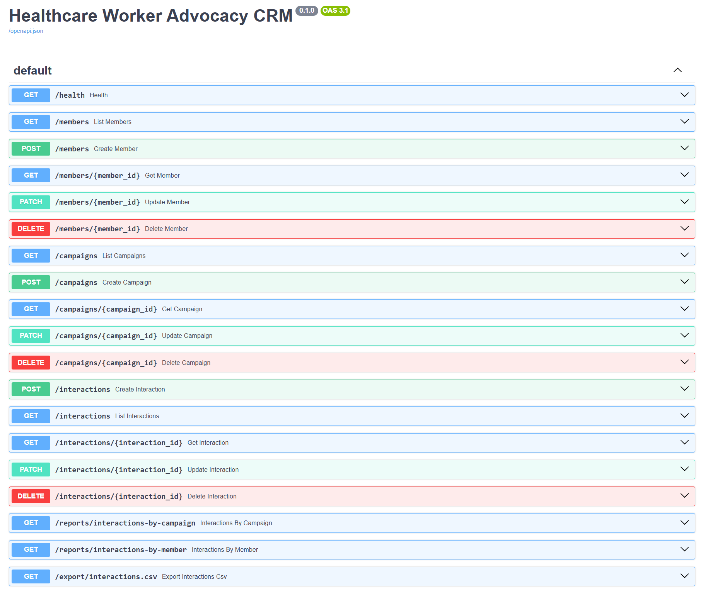
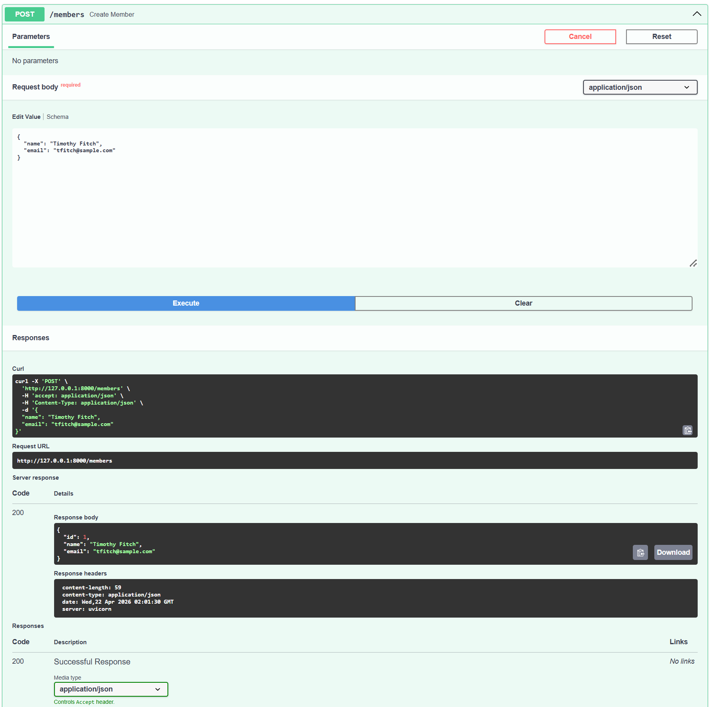
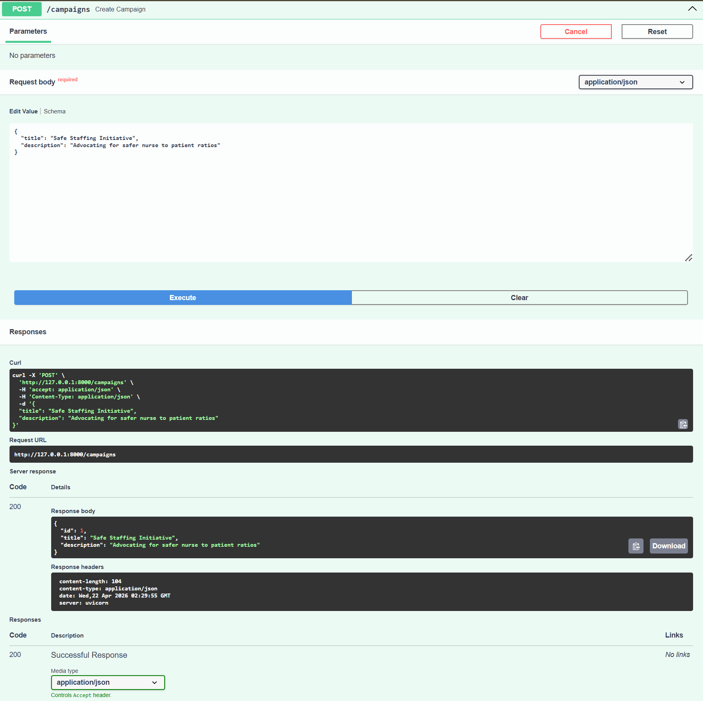
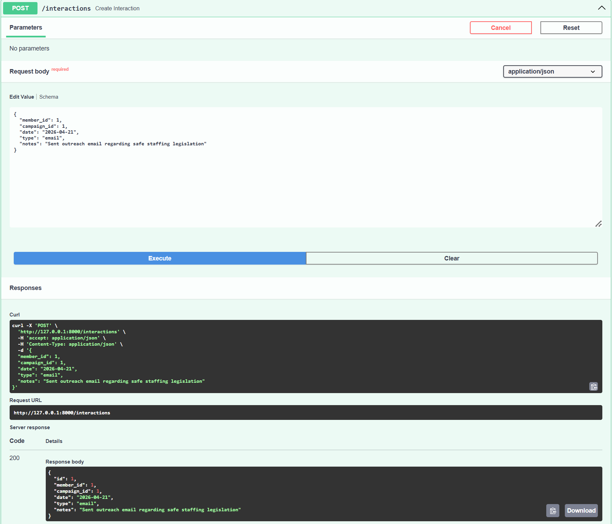
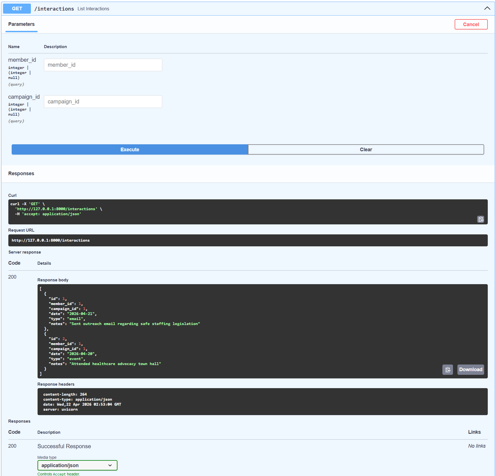
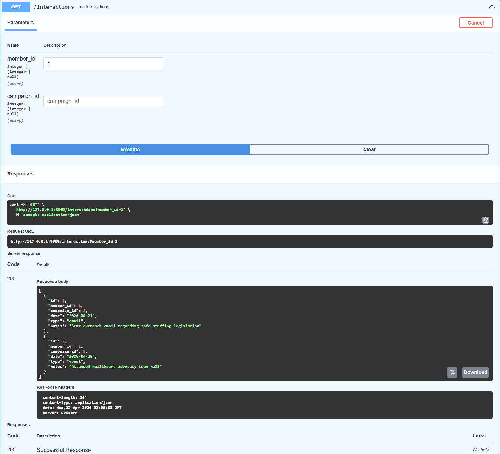
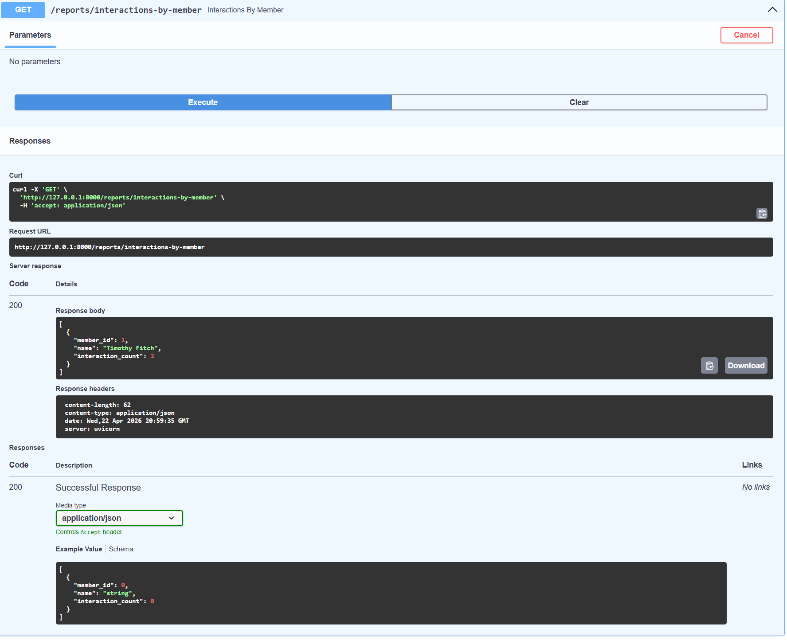
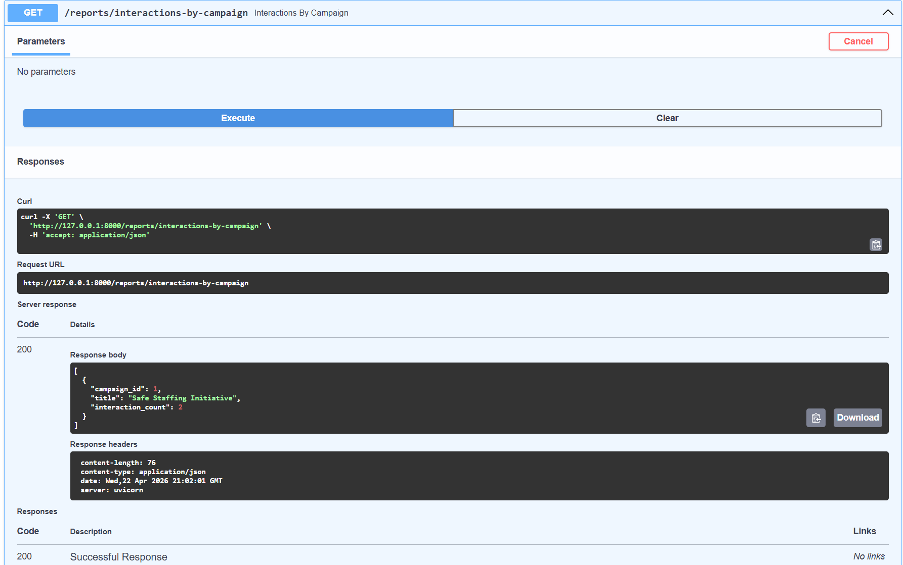

## System Demo

This section demonstrates the full backend workflow of the Healthcare Worker Advocacy CRM, from inputting data to exporting results.

---

## Step 1: API Running

The backend runs locally using FastAPI and exposes endpoints through the `/docs` interface.

---

## Step 2: Creating a Member

A member is created through the API and stored in the SQLite database.

---

## Step 3: Creating a Campaign

A campaign is created and becomes available for future interaction tracking.

---

## Step 4: Creating an Interaction

An interaction connects a member to a campaign and represents activity within the system.

---

## Step 5: Viewing Stored Data

The stored interaction data can be retrieved through the API, confirming that records are saved correctly.

---

## Step 6: Filtering Data

The system supports filtering interactions by member or campaign, allowing more targeted queries.

---

## Step 7: Reporting by Member

The backend includes reporting endpoints that summarize interaction counts by member.

---

## Step 8: Reporting by Campaign

Additional reports summarize interaction counts by campaign.

---

## Step 9: Exporting Data

Interaction data can be exported as a CSV file, completing the pipeline from input to usable output.

---

## Summary

The system supports:

- Creating and managing data through API endpoints
- Storing data in a relational SQLite database
- Filtering and retrieving records
- Generating summary reports
- Exporting interaction data to CSV

This demonstrates a complete backend data pipeline from input to output.